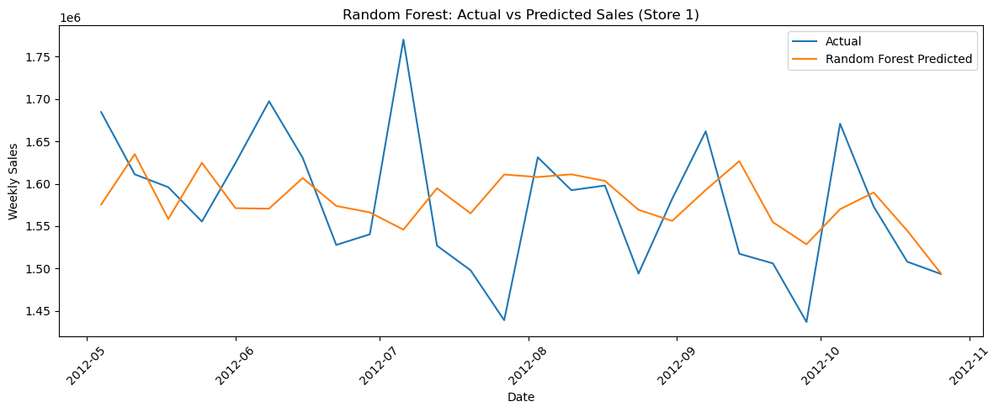
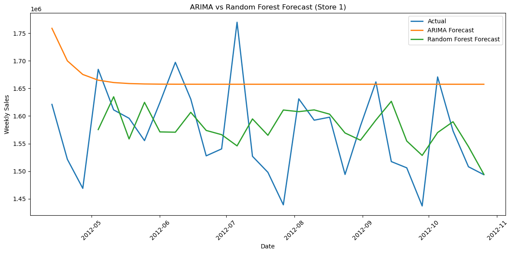

# Walmart Sales Forecasting

This project explores weekly sales forecasting using both classical time series methods and machine learning techniques on Walmart sales data.

## Objective
The goal is to compare statistical and machine learning approaches for forecasting weekly sales and evaluate their performance.

## Methods
- ARIMA for time series forecasting
- Random Forest for machine learning prediction
- Feature engineering including lag, rolling statistics, and calendar-based features

## Data Preparation
- Time-based sorting of sales data
- Lag features (1, 7, 14)
- Rolling mean and standard deviation
- Calendar features (month, week, day of week)
- Interaction features

## Evaluation Metrics
- Mean Absolute Error (MAE)
- Root Mean Squared Error (RMSE)

## Results
The project demonstrates how traditional time series methods and machine learning models perform differently depending on data structure and feature availability.

## Visualizations
### Random Forest Prediction

### ARIMA vs Random Forest Comparison

## Tools Used
Python, Pandas, NumPy, Matplotlib, Statsmodels, Scikit-learn

## Notes
This project is intended as a practical comparison of forecasting approaches and focuses on clarity, feature engineering, and model evaluation.
